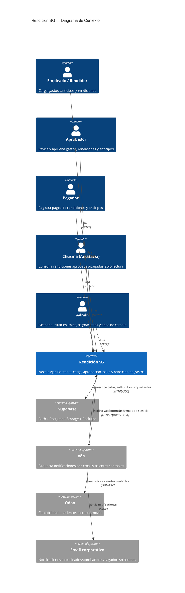
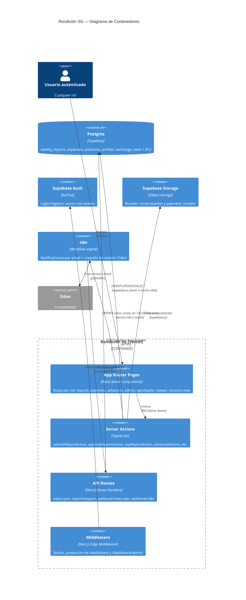
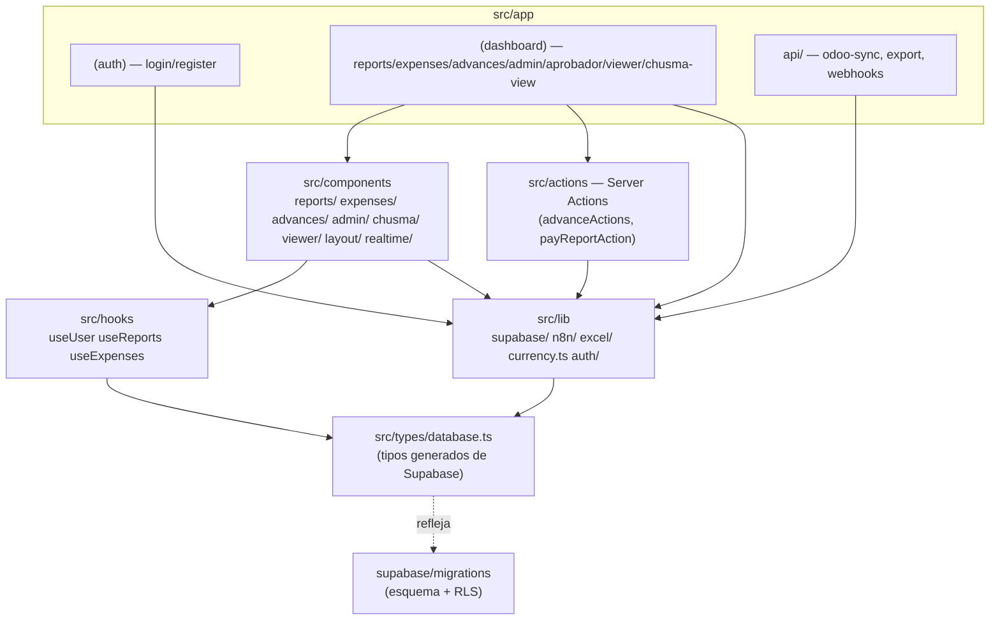
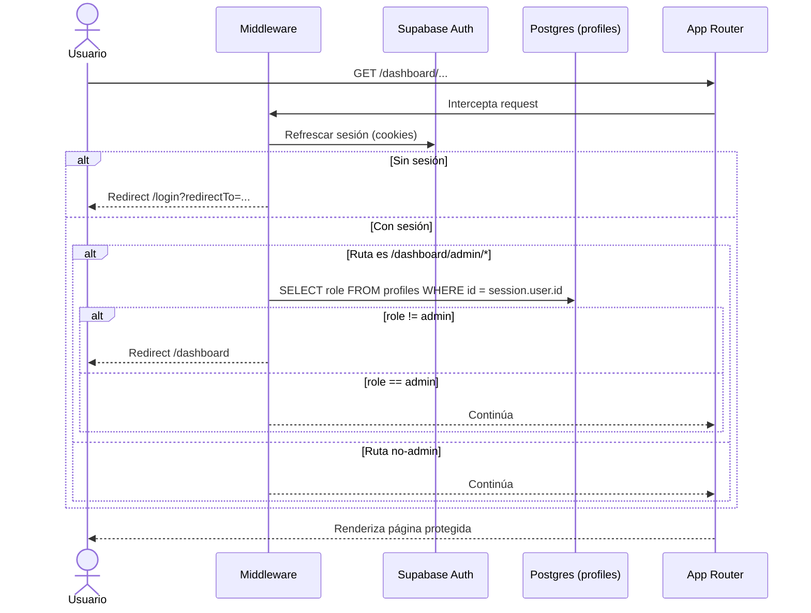
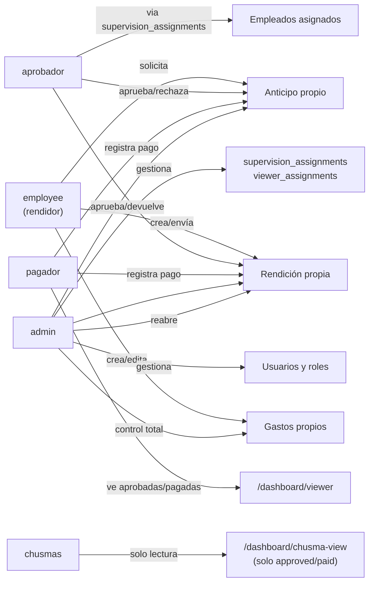
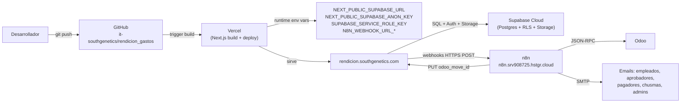

# Arquitectura — Rendición SG

> Plataforma interna de SouthGenetics para carga, aprobación, pago y rendición de gastos y anticipos. Producción: https://rendicion.southgenetics.com

## 1. Resumen ejecutivo

Rendición SG es una aplicación web interna construida sobre **Next.js 16 (App Router)** con **Supabase** como backend (Postgres + Auth + Storage + Realtime). Permite a empleados de SouthGenetics y Pacific Genomics cargar gastos semanales, agruparlos en una "rendición" (`weekly_reports`), enviarla a un aprobador, y que un pagador registre el pago. En paralelo existe un módulo de **anticipos** (`advances`) que, al pagarse, genera automáticamente una rendición vinculada para su posterior liquidación.

La lógica de negocio vive casi enteramente en **Server Actions** de Next.js que mutan Postgres directamente vía el cliente de Supabase (con políticas **RLS** como segunda capa de control). Cada transición de estado relevante (envío, aprobación, pago, anticipo) dispara un **webhook a n8n**, que se encarga de notificaciones por email y — cuando el medio de pago es `employee_paid` — de crear el asiento contable en **Odoo**. n8n llama de vuelta a un endpoint interno (`PUT /api/reports/[id]/odoo-sync`) para guardar el `odoo_move_id` resultante.

El acceso está segmentado por **rol** (`employee`, `aprobador`, `pagador`, `chusmas`, `admin`), reforzado tanto en middleware/Server Actions como en políticas RLS de Postgres. No hay backend separado: todo corre en el runtime de Next.js desplegado en Vercel.

### Diagrama C4 — Contexto

Quién interactúa con el sistema y con qué sistemas externos se comunica.



### Diagrama C4 — Contenedores

Cómo se descompone la aplicación en piezas desplegables y cómo se comunican.



## 2. Stack y dependencias

| Capa | Tecnología | Versión |
|---|---|---|
| Framework | Next.js (App Router) | 16.1.6 |
| UI | React | 19.2.3 |
| Lenguaje | TypeScript | ^5 |
| Estilos | Tailwind CSS | ^4 |
| Componentes accesibles | Radix UI (`dialog`, `dropdown-menu`, `select`) | — |
| Iconos | lucide-react | ^0.577 |
| Backend-as-a-Service | Supabase (`@supabase/supabase-js`, `@supabase/ssr`) | ^2.98 / ^0.9 |
| Fechas | date-fns | ^4 |
| Notificaciones UI | react-hot-toast | ^2.6 |
| Excel | xlsx (SheetJS) | ^0.18.5 |
| Despliegue | Vercel | — |
| Automatización / orquestación | n8n (self-hosted, `n8n.srv908725.hstgr.cloud`) | — |
| Contabilidad | Odoo (vía JSON-RPC, orquestado desde n8n) | — |

No hay un ORM: todas las queries usan el query builder de `@supabase/supabase-js` contra los tipos generados en `src/types/database.ts`.

## 3. Estructura de carpetas

```
src/
  app/
    (auth)/            login, register, forgot-password, reset-password
    (dashboard)/        área autenticada (ver mapa de rutas abajo)
    api/
      reports/export/route.ts            GET — descarga Excel de una rendición
      reports/[id]/odoo-sync/route.ts     PUT — n8n informa el odoo_move_id
      webhook/new-user/route.ts           POST — notifica alta de usuario a n8n
      webhook/n8n/route.ts                POST — callback OCR de ticket
  actions/             Server Actions reusables: advanceActions.ts, payReportAction.ts
  components/          UI por dominio: reports/, expenses/, advances/, admin/, chusma/, viewer/, layout/, realtime/
  lib/
    supabase/          client.ts, server.ts, middleware.ts (anon key en los tres)
    n8n/                helpers de payload + envío de cada webhook
    excel/, excelGenerator.ts            generación de .xlsx
    currency.ts                          conversión de monedas y settlement
    auth/                                getMyProfile.ts, emailDomain.ts
  hooks/               useUser, useReports, useExpenses (client-side)
  types/database.ts    tipos generados de Supabase (fuente de verdad del esquema)
supabase/migrations/   migraciones SQL versionadas (RLS, columnas nuevas)
n8n/                   snippets de workflows exportados (referencia, no el workflow completo)
```

Dentro de `(dashboard)` conviven páginas por rol bajo `reports/`, `expenses/`, `advances/` (vista del propio empleado), `aprobador/` (vista de supervisor), `admin/` (gestión global), `viewer/` (pagador/chusmas) y `chusma-view/` (auditoría). **Nota:** existe un árbol duplicado bajo `(dashboard)/dashboard/*` que espeja las mismas rutas — ver §9 deuda técnica.

### Diagrama de paquetes

Dependencias entre las carpetas principales del código fuente.



## 4. Modelo de dominio

Entidades centrales: `profiles` (usuarios + rol), `weekly_reports` (rendiciones), `expenses` (gastos, N:1 con una rendición), `advances` (anticipos, 1:1 opcional con la rendición que generan al pagarse), `supervision_assignments` (aprobador↔empleado), `viewer_assignments` (viewer custom↔empleado) y `exchange_rates` (tipos de cambio globales a USD). Ver el ERD completo y los diagramas de estado en `docs/DATABASE.md`.

## 5. Autenticación y autorización

- **Login/registro:** Supabase Auth (`signInWithPassword` / `signUp`), restringido a dominios `@southgenetics.com` y `@pacificgenomics.cl` (`src/lib/auth/emailDomain.ts`). Todo usuario nuevo nace con rol `employee`.
- **Middleware** (`src/lib/supabase/middleware.ts`): refresca la sesión, exige sesión para `/dashboard/*`, redirige a `/dashboard` si hay sesión y se visita `/login`/`/register`, y restringe `/dashboard/admin/*` a `role === "admin"`.
- **Server Actions:** cada acción sensible valida el rol explícitamente (`assertRole`/chequeos `if (role !== ...)`) antes de mutar datos.
- **RLS en Postgres:** segunda capa independiente de la aplicación — ver matriz de políticas en `docs/DATABASE.md` y `docs/ROLES.md`.
- **Excepción notable:** dos identidades (`nalvez@southgenetics.com` y un UUID fijo) se tratan como `admin` de forma hardcodeada en `getMyProfile.ts`, fuera de la tabla `profiles`. Ver riesgos en §9.

Detalle completo de permisos por rol en `docs/ROLES.md`.

### Flujo de autenticación



### Diagrama de roles y permisos

Qué puede hacer cada rol en cada módulo (resumen — matriz completa en `docs/ROLES.md`).



## 6. Flujos de negocio

Documentados con diagramas en `docs/FLOWS.md`:

1. Creación de rendición y carga de gastos
2. Envío a revisión → aprobación de gastos → cierre de rendición
3. Aprobación de rendición → webhook n8n → emails + asiento Odoo (rama `corporate_card` vs `employee_paid`)
4. Pago de rendición
5. Reapertura de rendición (admin)
6. Anticipos: solicitud → aprobación → pago → rendición automática → liquidación
7. Exportación a Excel

## 7. Integraciones externas

- **n8n** — 14+ webhooks salientes (creación/corrección/aprobación/pago/devolución de rendición; submitted/approved/rejected/paid de anticipos; nuevo usuario; OCR de ticket) y 1 endpoint entrante (`odoo-sync`). Ver `docs/INTEGRATIONS.md`.
- **Odoo** — Solo accesible desde n8n (no hay credenciales de Odoo en este repo); el repo solo expone el endpoint que recibe el `odoo_move_id` resultante.
- **Supabase Storage** — Buckets `comprobantes` (tickets de gastos, imágenes/PDF) y `payment_receipts` (comprobantes de pago de rendiciones y anticipos).

## 8. Variables de entorno

| Variable | Propósito |
|---|---|
| `NEXT_PUBLIC_SUPABASE_URL` | URL del proyecto Supabase |
| `NEXT_PUBLIC_SUPABASE_ANON_KEY` | Clave anónima (cliente browser/server, sujeta a RLS) |
| `SUPABASE_SERVICE_ROLE_KEY` | Clave de servicio — usada en `odoo-sync` y en `deleteAdvanceAction` para bypassear RLS |
| `NEXT_PUBLIC_N8N_WEBHOOK_URL` | Webhook OCR de ticket ("factura") |
| `NEXT_PUBLIC_N8N_NOTIFY_WEBHOOK_URL` | Webhook genérico de notificaciones (revisión/cierre) |
| `N8N_WEBHOOK_URL_NUEVA_RENDICION` | Envío inicial de una rendición |
| `N8N_WEBHOOK_URL_RENDICION_CORREGIDA` | Reenvío tras `needs_correction` |
| `N8N_WEBHOOK_URL_APROBAR_CIERRE` / `N8N_WEBHOOK_URL_RENDICION_APROBADA` | Aprobación/cierre de rendición (la primera tiene prioridad) |
| `N8N_WEBHOOK_URL_RENDICION_PAGADA` | Pago de rendición |
| `N8N_WEBHOOK_URL_RENDICION_DEVUELTA` | Devolución a corrección |
| `N8N_WEBHOOK_URL_ADVANCE_SUBMITTED` / `_APPROVED` / `_REJECTED` / `_PAID` | Ciclo de vida de anticipos |
| `N8N_WEBHOOK_URL_NUEVO_USUARIO` | Alta de usuario |
| `N8N_DEFAULT_CHUSMA_EMAIL` | Fallback si no hay perfiles con rol `chusmas` |

## 9. Despliegue

Cómo llega un cambio de código a producción y cómo se conectan los servicios en runtime.



## 10. Puntos de extensión / deuda técnica conocida

- **Rutas duplicadas:** `(dashboard)/dashboard/*` espeja `(dashboard)/*` — parece una migración a medio terminar. `[PENDIENTE: verificar]` cuál es la canónica antes de tocar layout/navegación.
- **Admin hardcodeado:** `getMyProfile.ts` trata un email y un UUID fijos como `admin` sin pasar por `profiles.role`. Riesgo si esa cuenta cambia de owner o el UUID se reasigna.
- **`odoo_move_id` no se limpia al reabrir:** `ReopenReportButton` resetea `status`, `closed_at` y `workflow_status`, pero no `odoo_move_id`. Una rendición reabierta y re-aprobada puede generar un segundo asiento Odoo sin que el primero se anule — riesgo contable.
- **Webhooks fire-and-forget:** ninguna llamada a n8n tiene retry ni cola; un fallo de red se loguea en consola y el flujo de negocio continúa igual (el estado en DB ya cambió). Puede producir desincronización entre la app y las notificaciones/asiento contable.
- **Routing por país/empresa a Odoo no vive en este repo:** el campo `profiles.country` existe pero el mapeo país→`company_id` de Odoo se resuelve enteramente en n8n; no hay forma de auditarlo desde el código de la app.
- **`total_amount` de `weekly_reports` no se persiste automáticamente:** se recalcula en cada render desde `expenses` vía `src/lib/currency.ts`; cualquier nueva pantalla que necesite el total debe repetir ese cálculo en vez de leer el campo de DB.
- **Roles legados en el enum (`seller`, `supervisor`, `chusma` singular):** convivendo con los roles activos (`employee`, `aprobador`, `pagador`, `chusmas`, `admin`) por compatibilidad; nuevo código debe asumir los activos pero los checks de rol deben seguir aceptando los alias.
