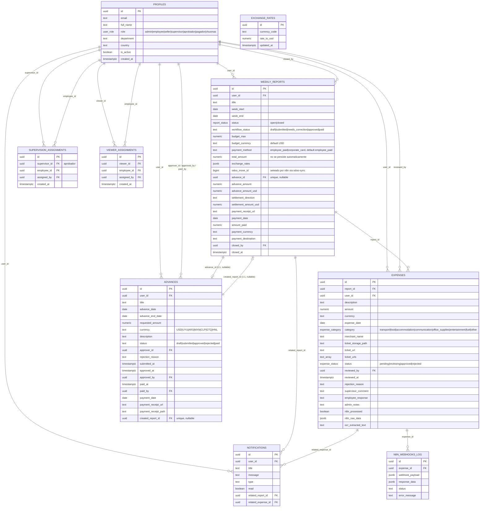
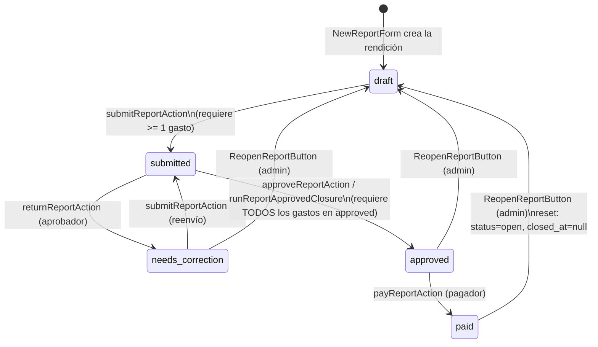
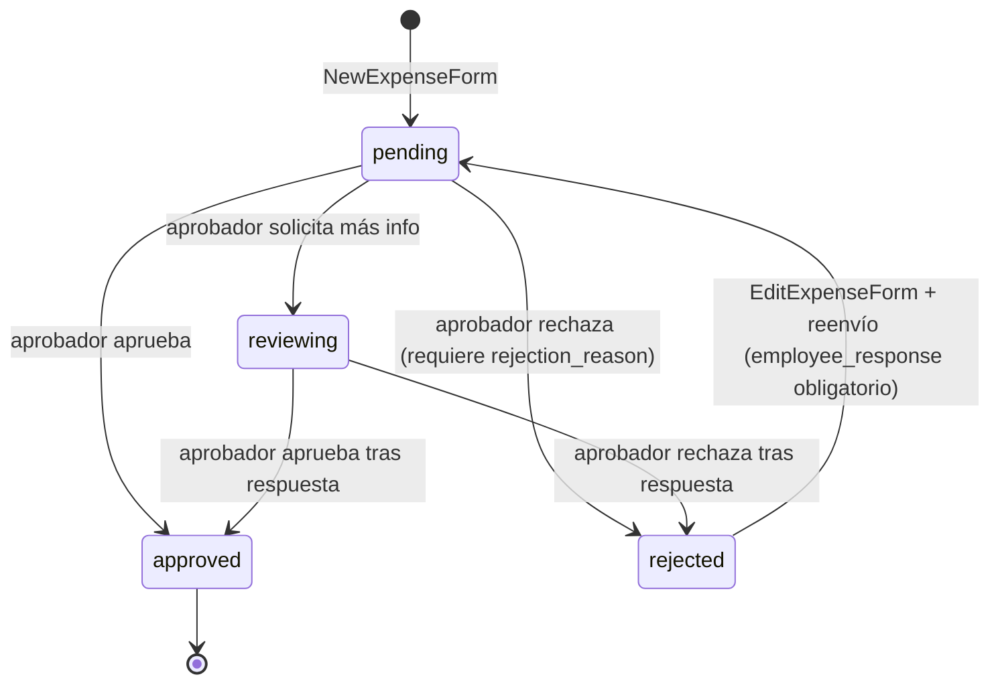
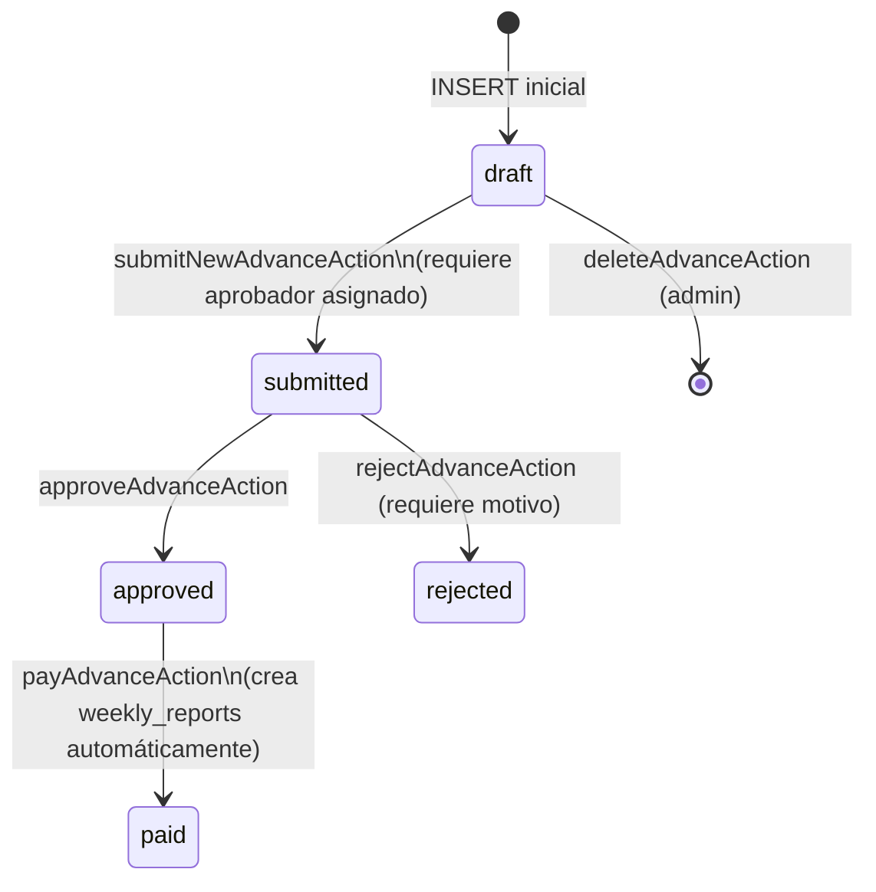

# Base de datos — Rendición SG

Esquema real extraído de `src/types/database.ts` (tipos generados por Supabase) y de las migraciones en `supabase/migrations/`. Estado al 2026-06-16.

## 1. ERD completo

Relaciones y cardinalidades entre las tablas principales del dominio.

## 2. Descripción de tablas

### `profiles`
Usuario de la app, 1:1 con `auth.users`. El rol (`role`) gobierna toda la autorización de la aplicación, reforzado por RLS. Valores activos: `employee`, `aprobador`, `pagador`, `chusmas`, `admin`. Valores legados que persisten por compatibilidad: `seller`, `supervisor`, `chusma` (singular).

### `weekly_reports`
La "rendición" semanal de un empleado. Agrupa `expenses` y, opcionalmente, se vincula 1:1 con un `advances` (en ambas direcciones: `weekly_reports.advance_id` y `advances.created_report_id`). Dos campos de estado coexisten:
- `status` (`open`/`closed`) — ciclo de vida "contenedor abierto a nuevos gastos" vs cerrado.
- `workflow_status` (`draft`/`submitted`/`needs_correction`/`approved`/`paid`) — el flujo de aprobación real, consumido por toda la UI y por los webhooks.

`payment_method` determina si n8n debe crear un asiento en Odoo (`employee_paid`) o saltarlo (`corporate_card`, vía el flag `skipOdooEntry`). `odoo_move_id` solo lo escribe el endpoint `PUT /api/reports/[id]/odoo-sync`, nunca el código de la aplicación.

### `expenses`
Un gasto individual cargado por el empleado, siempre asociado a una `weekly_reports`. `status` se revisa gasto por gasto por el aprobador; cuando **todos** los gastos de una rendición quedan en `approved`, se dispara el cierre automático de la rendición (`tryAutoFinalizeReportAfterAllExpensesApprovedAction`). `ticket_url` es el campo legado de un solo comprobante; `ticket_urls` (array) es el actual. `n8n_raw_data`/`ocr_extracted_text` guardan la respuesta del webhook de OCR de ticket.

### `advances`
Solicitud de anticipo de un empleado. Al pagarse (`status = paid`), la acción crea automáticamente una `weekly_reports` vinculada (`created_report_id`) con `advance_amount_usd` precalculado, para que la liquidación final (settlement) se calcule cuando esa rendición se paga.

### `exchange_rates`
Tabla de referencia, sin relaciones. Un row por `currency_code`, con `rate_to_usd` ("1 USD = X moneda"). Editable globalmente por admin (`GlobalExchangeRateEditor`); cada `weekly_reports` puede sobreescribir estos valores en su propio campo `exchange_rates` (jsonb).

### `supervision_assignments`
Relación N:M aprobador↔empleado. Determina qué `weekly_reports`/`expenses`/`advances` puede ver y aprobar un usuario con `role = aprobador`, tanto en la aplicación como en las políticas RLS.

### `viewer_assignments`
Análoga a `supervision_assignments` pero para viewers personalizados (no chusma/pagador, que ven todo sin necesidad de asignación explícita).

### `notifications` / `n8n_webhooks_log`
Tablas de soporte: `notifications` almacena notificaciones in-app; `n8n_webhooks_log` registra intentos de invocación de webhooks (payload, respuesta, error) — `[PENDIENTE: verificar]` si se usa de forma consistente en todos los webhooks o solo en el de OCR de ticket.

## 3. Migraciones relevantes (orden cronológico)

| Fecha | Migración | Efecto |
|---|---|---|
| 2026-03-19 | `add_odoo_move_id_to_weekly_reports.sql` | Agrega `odoo_move_id` (bigint, nullable) |
| 2026-03-20 | `add_budget_currency_to_weekly_reports.sql` | Agrega `budget_currency` (default `USD`) |
| 2026-03-24 | `allow_pdf_in_comprobantes_bucket.sql` | Bucket `comprobantes` acepta `application/pdf` además de imágenes |
| 2026-03-26 | `remove_unique_weekly_reports_user_id_week_start_key.sql` | Elimina UNIQUE `(user_id, week_start)` — permite varias rendiciones en la misma semana |
| 2026-04-23 | `create_advances_and_weekly_report_settlement.sql` | Crea tabla `advances`; agrega a `weekly_reports`: `advance_id`, `advance_amount_usd`, `settlement_direction`, `settlement_amount_usd`, `payment_currency` |
| 2026-04-23 | `advances_rls_policies.sql` | Políticas RLS completas para `advances` |
| 2026-04-23 | `expenses_rls_staff_select.sql` | Políticas SELECT por rol para `expenses` |
| 2026-04-24 | `fix_advances_insert_policy_submitted.sql` | INSERT permite `status IN ('draft','submitted')` |
| 2026-04-24 | `fix_advances_permissions_and_insert_policy.sql` | GRANT a `authenticated` + ajuste de policy INSERT |
| 2026-04-24 | `expenses_admin_update_policy.sql` | Policy UPDATE para admin en `expenses` |
| 2026-04-24 | `add_advance_amount_to_weekly_reports.sql` | Agrega `advance_amount` |
| 2026-04-24 | `add_advance_end_date.sql` | Agrega `advance_end_date` a `advances` |
| 2026-05-05 | `advances_fix_insert_policy_and_add_delete.sql` | Restringe INSERT a `draft`; agrega DELETE para admin |
| 2026-05-08 | `fix_advances_delete_policy_for_hardcoded_admin.sql` | Asegura `role='admin'` en `profiles` para la cuenta admin hardcodeada |
| 2026-05-11 | `advances_admin_delete_policy_and_grant.sql` | Re-crea policy DELETE + GRANT (sincroniza remoto) |
| 2026-05-11 | `grant_service_role_on_advances_and_assignments.sql` | GRANT ALL a `service_role` en `advances`, `supervision_assignments`, `viewer_assignments` |
| 2026-05-11 | `expenses_admin_delete_policy.sql` | Policy DELETE para admin en `expenses` |
| 2026-05-14 | `add_payment_method_to_weekly_reports.sql` | Agrega `payment_method` con CHECK `IN ('employee_paid','corporate_card')` |

**Nota:** `profiles`, `weekly_reports` (base), `expenses` (base), `exchange_rates`, `supervision_assignments`, `viewer_assignments`, `notifications` y `n8n_webhooks_log` no tienen migración versionada en el repo — fueron creadas antes de empezar a versionar `supabase/migrations/`. `[PENDIENTE: verificar]` si existe un dump/seed inicial fuera de este repo.

## 4. Políticas RLS relevantes

### `advances`

| Policy | Operación | Regla |
|---|---|---|
| `advances_select_owner` | SELECT | `user_id = auth.uid()` |
| `advances_select_admin` | SELECT | `role = 'admin'` |
| `advances_select_chusmas` | SELECT | `role = 'chusmas'` |
| `advances_select_pagador` | SELECT | `role = 'pagador'` |
| `advances_select_aprobador_assignment` | SELECT | `role = 'aprobador'` y existe fila en `supervision_assignments` |
| `advances_insert_owner_draft` | INSERT | `user_id = auth.uid() AND status = 'draft'` |
| `advances_update_owner_draft` | UPDATE | owner, `status IN ('draft','rejected')` → `('draft','submitted')` |
| `advances_update_aprobador` | UPDATE | `status='submitted'` + asignación → `('approved','rejected')` |
| `advances_update_pagador` | UPDATE | `status='approved'` + `role='pagador'` → `'paid'` |
| `advances_update_admin` / `advances_delete_admin` | UPDATE/DELETE | `role = 'admin'` |

### `expenses`

| Policy | Operación | Regla |
|---|---|---|
| `expenses_select_staff_admin` | SELECT | `role = 'admin'` |
| `expenses_select_staff_chusmas_pagador` | SELECT | `role IN ('chusmas','pagador')` |
| `expenses_select_staff_aprobador_supervised` | SELECT | `role='aprobador'` y el `report_id` pertenece a un empleado asignado |
| `expenses_select_staff_viewer_assignment` | SELECT | `viewer_id` en `viewer_assignments` para `expense.user_id` |
| `expenses_update_staff_admin` / `expenses_delete_staff_admin` | UPDATE/DELETE | `role = 'admin'` |

`service_role` tiene `ALL` sobre `advances`, `supervision_assignments` y `viewer_assignments` (usado por `deleteAdvanceAction` y por el endpoint `odoo-sync`, este último opera sobre `weekly_reports`).

## 5. Diagramas de estado

### Rendición (`weekly_reports.workflow_status`)

> Nota: la reapertura (`ReopenReportButton`) no resetea `odoo_move_id` ni los `status` de los `expenses` asociados — ver deuda técnica en `ARCHITECTURE.md`.

### Gasto (`expenses.status`)

> Las transiciones de gasto solo se permiten si la rendición asociada está en `workflow_status = submitted`.

### Anticipo (`advances.status`)

