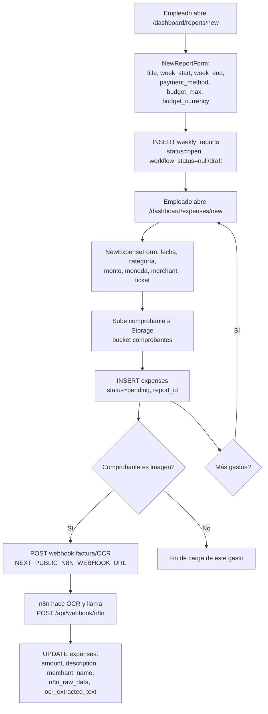
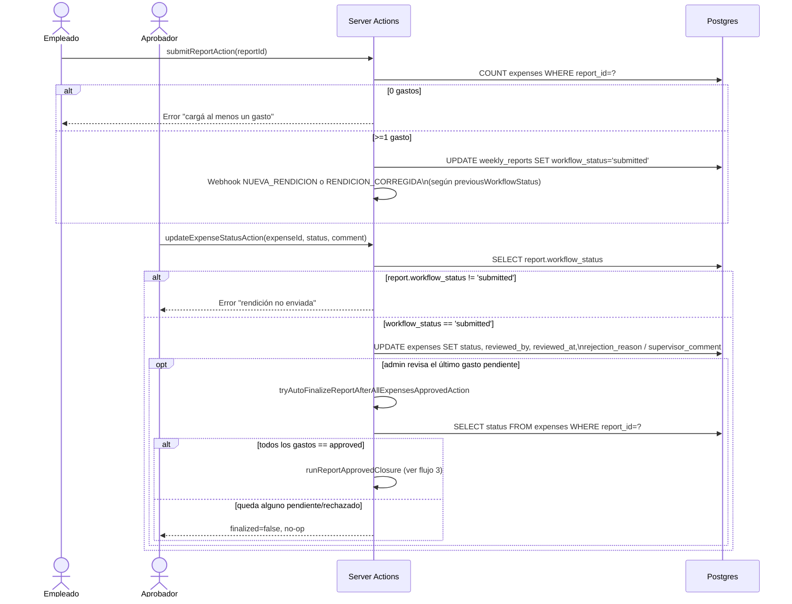
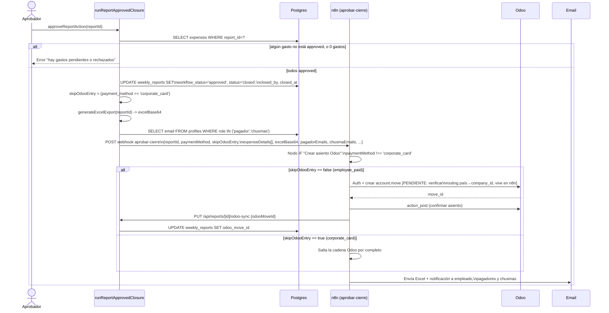
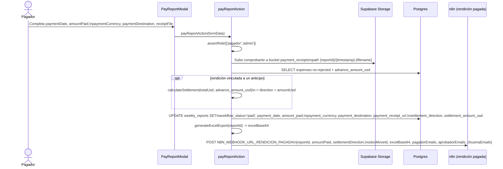
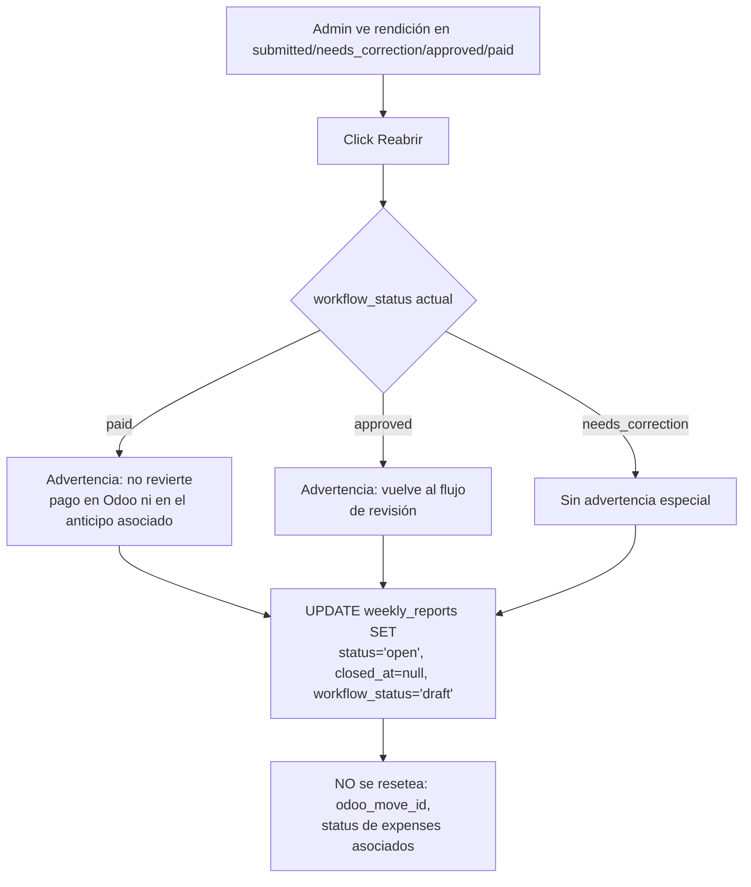
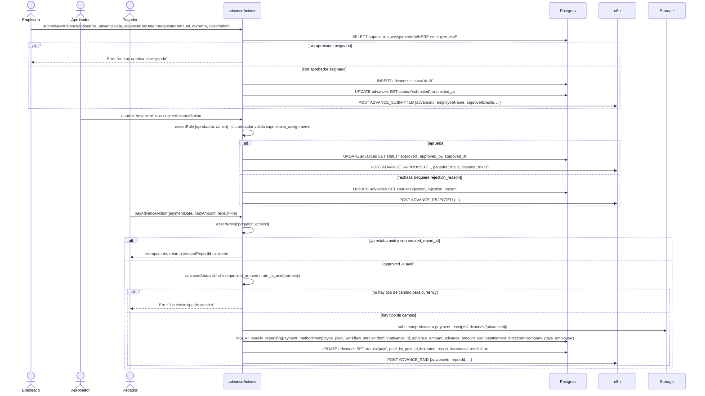
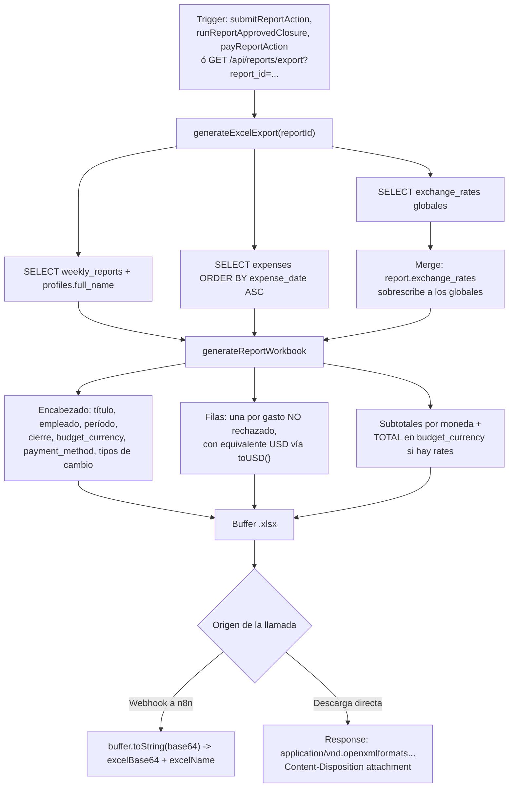

# Flujos de negocio — Rendición SG

Cada flujo cita los archivos reales (Server Actions, componentes, API routes) y los webhooks de n8n que dispara. Estados y nombres coinciden con `docs/DATABASE.md` y `docs/ROLES.md`.

## 1. Creación de rendición y carga de gastos

**Archivos:** `src/components/reports/NewReportForm.tsx`, `src/components/expenses/NewExpenseForm.tsx`, `src/lib/n8n/sendExpenseWebhook.ts`.

La rendición queda en `status=open`, `workflow_status` implícitamente `draft` hasta que se envía a revisión (flujo 2).

## 2. Envío a revisión → aprobación de gastos → cierre de rendición

**Archivos:** `submitReportAction.ts`, `expenses/[id]/page.tsx` (`updateExpenseStatusAction`), `approveReportAction.ts` (`tryAutoFinalizeReportAfterAllExpensesApprovedAction`), `runReportApprovedClosure.ts`.

Un gasto puede volver a `pending` si el empleado lo edita y reenvía tras un rechazo (`EditExpenseForm`, con `employee_response` obligatorio).

## 3. Aprobación de rendición → webhook n8n → emails + asiento Odoo

**Archivos:** `approveReportAction.ts`, `runReportApprovedClosure.ts`, `src/app/api/reports/[id]/odoo-sync/route.ts`, snippet `n8n/import-if-crear-asiento-odoo.json`.

**Riesgos señalados:**
- El mapeo país/regional → `company_id` de Odoo **no está en este repo**: vive enteramente en la configuración de n8n. No hay forma de auditarlo desde el código de la app — `[PENDIENTE: verificar]` directamente en n8n.
- El webhook es fire-and-forget: si la llamada HTTP falla, el estado en Postgres (`approved`/`closed`) ya quedó actualizado y no hay reintento ni cola; la rendición queda "aprobada" sin notificación ni asiento Odoo hasta que alguien lo note manualmente.
- Si se reabre y se re-aprueba una rendición que ya tenía `odoo_move_id`, el código no verifica si ya existe un asiento antes de volver a llamar al webhook — riesgo de asiento contable duplicado.

## 4. Pago de rendición

**Archivos:** `src/components/reports/PayReportModal.tsx`, `src/actions/payReportAction.ts`.

`settlementDirection` puede ser `company_pays_employee`, `employee_returns_company` o `settled_zero`, según si el total gastado superó o no el anticipo recibido.

## 5. Reapertura de rendición (admin)

**Archivo:** `src/components/admin/ReopenReportButton.tsx`.

**Riesgo:** dejar `odoo_move_id` intacto significa que, si la rendición se vuelve a aprobar, el flujo de n8n no tiene forma de saber (desde este repo) que ya existe un asiento contable previo.

## 6. Anticipos: solicitud → aprobación → pago → vinculación con rendición → liquidación

**Archivos:** `src/actions/advanceActions.ts` (`submitNewAdvanceAction`, `approveAdvanceAction`, `rejectAdvanceAction`, `payAdvanceAction`), `src/lib/n8n/sendAdvanceWebhook.ts`.

La liquidación final ocurre cuando esa rendición automática se paga (flujo 4): `calculateSettlement` compara lo gastado contra `advance_amount_usd` y determina si la empresa le debe al empleado, viceversa, o si quedó saldado.

## 7. Exportación a Excel

**Archivos:** `src/lib/excelGenerator.ts` (`generateExcelExport`), `src/lib/excel/generateReport.ts` (`generateReportWorkbook`), `src/app/api/reports/export/route.ts`.

