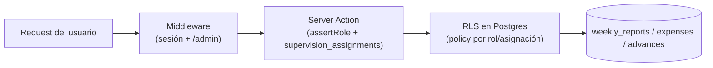

# Roles y permisos — Rendición SG

Roles activos en `profiles.role`: `employee`, `aprobador`, `pagador`, `chusmas`, `admin`. Roles legados que persisten en la base por compatibilidad pero no se asignan a usuarios nuevos: `seller`, `supervisor`, `chusma` (singular).

**Excepción hardcodeada:** `src/lib/auth/getMyProfile.ts` trata como `admin` a un UUID fijo y al email `nalvez@southgenetics.com`, sin pasar por `profiles.role`. Es deuda técnica — ver `ARCHITECTURE.md` §10.

## 1. Matriz rol × acción × pantalla

| Acción / Pantalla | employee | aprobador | pagador | chusmas | admin |
|---|---|---|---|---|---|
| `/dashboard` (resumen propio) | ✓ | ✓ | ✓ | ✓ | ✓ |
| Crear/editar gasto propio (`/dashboard/expenses/new`) | ✓ | ✓ | ✓ | — | ✓ |
| Crear/enviar rendición propia (`/dashboard/reports`) | ✓ | ✓ | ✓ | — | ✓ |
| Solicitar anticipo propio (`/dashboard/advances/new`) | ✓ | ✓ | ✓ | — | ✓ |
| `/dashboard/aprobador` — ver empleados asignados | ✗ | ✓ (vía `supervision_assignments`) | ✗ | ✗ | ✓ (todos) |
| Aprobar/devolver gasto individual | ✗ | ✓ (solo asignados) | ✗ | ✗ | ✓ |
| Aprobar/devolver rendición (`approveReportAction`/`returnReportAction`) | ✗ | ✓ (solo asignados) | ✗ | ✗ | ✓ |
| Aprobar/rechazar anticipo (`approveAdvanceAction`/`rejectAdvanceAction`) | ✗ | ✓ (solo asignados, no propios) | ✗ | ✗ | ✓ |
| Registrar pago de rendición (`payReportAction`) | ✗ | ✗ | ✓ | ✗ | ✓ |
| Registrar pago de anticipo (`payAdvanceAction`) | ✗ | ✗ | ✓ | ✗ | ✓ |
| `/dashboard/viewer` — ver personas con rendiciones/anticipos | ✗ | ✗ | ✓ (aprobadas/pagadas) | ✓ (todas) | ✓ (todas) |
| `/dashboard/chusma-view` — auditoría | ✗ | ✗ | ✓ | ✓ | ✓ |
| ↳ alcance de chusma-view | — | — | solo `approved`/`paid` | solo `approved`/`paid` | todo |
| `/dashboard/admin/*` — usuarios, roles, asignaciones | ✗ | ✗ | ✗ | ✗ | ✓ |
| Editar tipos de cambio globales | ✗ | ✗ | ✗ | ✗ | ✓ |
| Reabrir rendición (`ReopenReportButton`) | ✗ | ✗ | ✗ | ✗ | ✓ |
| Eliminar anticipo (`deleteAdvanceAction`) | ✗ | ✗ | ✗ | ✗ | ✓ |
| Eliminar gasto / rendición / usuario | ✗ | ✗ | ✗ | ✗ | ✓ |

## 2. Cómo se determina el alcance de cada rol

- **`aprobador`** nunca ve "todo" — su alcance está acotado por filas en `supervision_assignments` (`supervisor_id` = su `id`). Tanto en la UI (`/dashboard/aprobador`) como en las políticas RLS de `advances` y `expenses`, el acceso se valida contra esa tabla, no contra el rol solo.
- **`pagador`** y **`chusmas`** ven todo el universo de rendiciones/anticipos relevantes a su rol (sin necesidad de asignación), pero `chusmas` está restringido a estados terminales (`approved`/`paid`) en `chusma-view`.
- **Viewers personalizados** (no contemplados como rol propio, sino vía `viewer_assignments`) pueden ver el detalle de empleados específicos sin ser `pagador` ni `chusmas` — `[PENDIENTE: verificar]` qué rol de `profiles` se combina con esta tabla en producción.
- **`admin`** no tiene restricciones de alcance en ningún módulo.

## 3. Capas de enforcement

Cada permiso de la matriz se aplica en hasta tres capas independientes — un cambio de permisos requiere tocar las que correspondan:

1. **Middleware** (`src/lib/supabase/middleware.ts`) — solo protege `/dashboard/*` (requiere sesión) y `/dashboard/admin/*` (requiere `role=admin`). No conoce `aprobador`/`pagador`/`chusmas`.
2. **Server Actions** — cada acción sensible repite el chequeo de rol explícitamente (`assertRole(...)` o `if (!["aprobador","admin"].includes(role))`), y para `aprobador` además valida la fila correspondiente en `supervision_assignments`.
3. **RLS en Postgres** — políticas independientes del código de la aplicación sobre `advances` y `expenses` (detalladas en `docs/DATABASE.md` §4); funcionan como red de seguridad si una Server Action tuviera un bug de autorización.

## 4. Navegación por rol

`src/components/layout/navItems.ts` define qué ítems del menú son visibles según flags calculados en el layout del dashboard (`isAdmin`, `isSupervisor`, `isViewer`, `isPagador`):

| Item de menú | Visible para |
|---|---|
| Resumen, Rendiciones, Anticipos, Histórico | todos los roles |
| Aprobaciones (`/dashboard/aprobador`) | `aprobador`, `admin` |
| Auditoría (`/dashboard/chusma-view`) | `chusmas`, `admin` |
| Pagos (`/dashboard/viewer`) | `pagador`, `admin` |
| Admin (`/dashboard/admin`) | `admin` |
